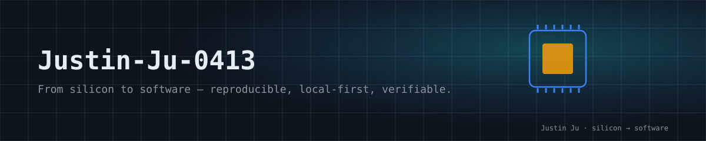

  

# Justin Ju / 巨嘉兴

**From silicon to software — reproducible, local-first, verifiable.**
**从硅到软件 — 可复现、本地优先、可验证。**

Microelectronics @ South China University of Technology (SCUT) · RISC-V · FPGA · Verilog · TypeScript · React · Local-first AI

[GitHub](https://github.com/Justin-Ju-0413) · Guangzhou, China

---

## The line / 主线

我设计芯片，也写产品。这条线从 RTL 出发，穿过 NICE 接口、FPGA 板级验证，落脚于本地优先的 AI 工具——每一段都有证据，没有证据的边界我会写清楚。

> I design silicon and I ship software. The thread runs from RTL, through the NICE interface and FPGA board bring-up, down to local-first AI products — every claim backed by evidence, every boundary marked.

## Flagships / 旗舰

| Project | What it is | Verifiable evidence | Start here |
|---|---|---|---|
| [riscv_cnn_accelerator](https://github.com/Justin-Ju-0413/riscv_cnn_accelerator) | INT8 CNN accelerator on Hummingbird E203 via NICE. 4×4 PE, output-stationary. | RTL regression, full-SoC closure (RSTAT=320), 10-sample FPGA LeNet-5 demo; claim boundaries documented. | [docs/QUICKSTART.md](https://github.com/Justin-Ju-0413/riscv_cnn_accelerator/blob/main/docs/QUICKSTART.md) |
| [moneynote](https://github.com/Justin-Ju-0413/moneynote) | Local-first finance PWA: natural-language entry, bill import, dedup, backup, privacy-aware AI. | Runs without an API key; import/export, recovery and dedup covered by regression tests. | [README](https://github.com/Justin-Ju-0413/moneynote#运行) |
| [aihome](https://github.com/Justin-Ju-0413/aihome) | Local visual workspace for AGENTS.md / SKILL.md: kanban board, relationship graph, sandboxed file API. | No-setup demo workspace; Playwright API + UI coverage; path-sandboxed endpoints. | [README](https://github.com/Justin-Ju-0413/aihome#getting-started) |
| [comfyui-amd-rocm-kit](https://github.com/Justin-Ju-0413/comfyui-amd-rocm-kit) | Reproducible Windows ROCm deployment kit for AMD RX 9070 XT, with validated workflows. | Validated Flux / LTX benchmarks on 16GB; repo checks run without a GPU. | [README](https://github.com/Justin-Ju-0413/comfyui-amd-rocm-kit#最短使用路径) |

## Historical tools / 历史工具

以下仓库已归档，当前相关能力以 [AIHome](https://github.com/Justin-Ju-0413/aihome) 为入口：

- [skillhub](https://github.com/Justin-Ju-0413/skillhub) — 历史技能注册表。
- [skill-sync](https://github.com/Justin-Ju-0413/skill-sync) — 历史跨 agent 技能同步工具。
- [ccswitch-usage-widget](https://github.com/Justin-Ju-0413/ccswitch-usage-widget) — 历史用量悬浮窗；当前用量看板位于 AIHome。

## Engineering boundaries / 工程边界

- 自动化结果以各仓库 CI 与 Release 为准;未运行的 GPU、Windows/WSL 或真实硬件验证会明确标记,不用静态检查替代。
- Experimental interfaces do not imply production capability — see each repo's claim boundaries.
- 页面不展示私有资料库、内部交接记录或无法从 GitHub 现状核实的统计。

## Tech / 技术栈

Verilog · SystemVerilog · RISC-V · FPGA · Python · TypeScript · React · Next.js · PowerShell · Git

## Contact / 联系

项目问题请在对应仓库提交 Issue。
For project questions, open an issue in the relevant repository.
